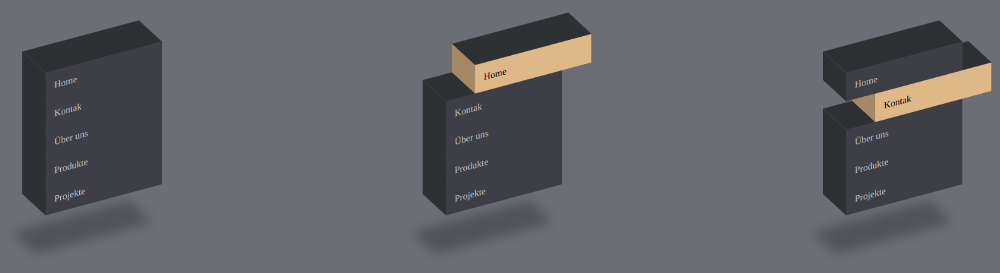

# 🎨 3D Menü mit HTML & CSS


## 📝 Projektbeschreibung
Ein stilisiertes **3D-Menü**, das mit **HTML & CSS** erstellt wurde. Die Navigationselemente bewegen sich mit einer **schrägen Perspektive** und einer **hover-basierten Animation**, um einen realistischen **3D-Effekt** zu erzeugen.

## 🚀 Technologien
- **HTML5** – Struktur der Navigation
- **CSS3** – 3D-Transformationen, Animationen & Styles
- **Flexbox** – Zentrierung der Elemente

## 🎬 Live-Demo
🔗 [Demo hier ansehen](#) *(Füge hier die Live-Demo-URL ein)*

<div>

</div>

## 📦 Installation & Nutzung
### 📥 1. Repository klonen
```bash
git clone <repo-url>
cd HTML-CSS-3D-Menu
```

### 🖥 2. Öffne die `index.html`
Da es sich um eine reine **HTML & CSS-Anwendung** handelt, benötigst du keine zusätzliche Installation. Einfach die Datei **`index.html`** im Browser öffnen.

## 📂 Projektstruktur
```
HTML-CSS-3D-Menu/
├──media
    ├──4.png          # Vorschaubild des Menüs  
├── index.html        # Hauptdatei für die Menüstruktur
├── style.css         # CSS-Styling und 3D-Animationen
└── README.md         # Dokumentation
```

## 🛠 Anpassungen
✅ **Farbgestaltung ändern:** Passe die Farben in `style.css` an.
✅ **Menüpunkte anpassen:** Bearbeite `index.html`, um die Menüelemente zu ändern.
✅ **Animationseffekte modifizieren:** Ändere die **transform** und **transition** Werte in der CSS-Datei.

## 🏆 Features
✔️ **Dynamische 3D-Transformationen** 🎭  
✔️ **Hover-Effekte mit sanften Animationen** 🎨  
✔️ **Leichtgewichtig & schnell ladend** ⚡

## 📜 Lizenz
Dieses Projekt ist unter der **MIT License** lizenziert. 🎯


